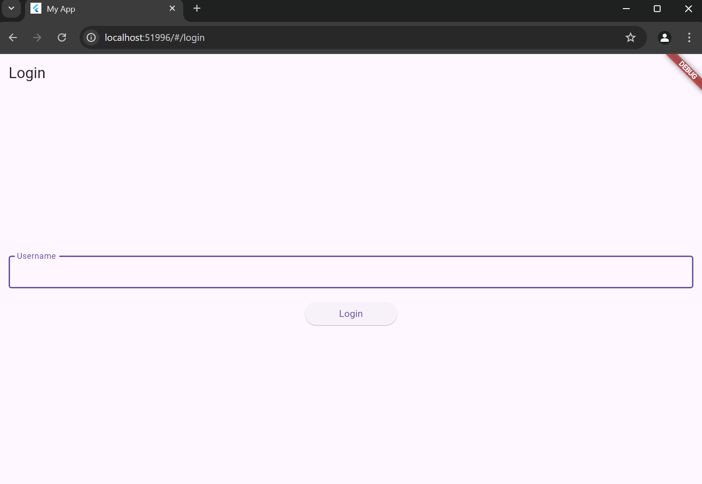
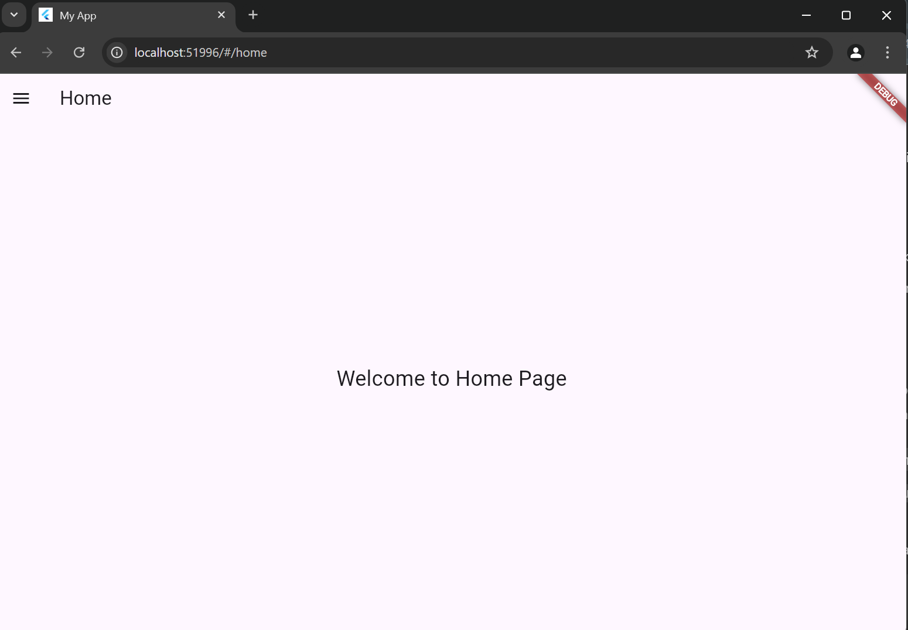
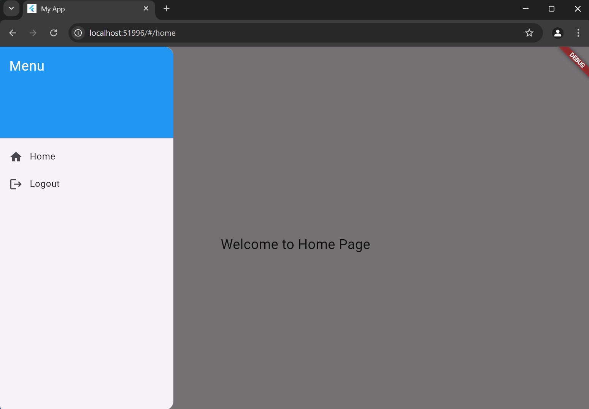

# LabMobile3_EndiniNurlaily_ShiftC
# LabMobile3: Aplikasi Login dengan Flutter

## Deskripsi
Aplikasi ini merupakan contoh aplikasi Flutter yang menerapkan fitur login dengan menggunakan `SharedPreferences` untuk menyimpan status login pengguna. Aplikasi ini juga memiliki menu samping dan tampilan yang sederhana namun menarik.

## Struktur Proyek
Berikut adalah struktur folder proyek ini:


## Penjelasan Kode

### 1. **`main.dart`**
File ini merupakan titik masuk aplikasi. Di sini, kita memeriksa apakah pengguna sudah login atau belum menggunakan `SharedPreferences`. Jika sudah, aplikasi akan langsung menuju halaman home, jika belum, akan menuju halaman login.

```dart
void main() async {
  WidgetsFlutterBinding.ensureInitialized();
  SharedPreferences prefs = await SharedPreferences.getInstance();
  bool isLoggedIn = prefs.getBool('isLoggedIn') ?? false;

  runApp(MyApp(isLoggedIn: isLoggedIn));
}

class User {
  String username;
  String email;

  User({required this.username, required this.email});

  Map<String, dynamic> toMap() {
    return {
      'username': username,
      'email': email,
    };
  }
}

class LoginPage extends StatelessWidget {
  @override
  Widget build(BuildContext context) {
    return Scaffold(
      appBar: AppBar(title: Text('Login')),
      body: Center(
        child: LoginForm(),
      ),
    );
  }
}

class HomePage extends StatelessWidget {
  @override
  Widget build(BuildContext context) {
    return Scaffold(
      appBar: AppBar(title: Text('Home')),
      drawer: SideMenu(),
      body: Center(
        child: Text('Welcome to Home Page', style: TextStyle(fontSize: 24)),
      ),
    );
  }
}

Future<void> _login(BuildContext context) async {
  SharedPreferences prefs = await SharedPreferences.getInstance();
  await prefs.setBool('isLoggedIn', true);
  Navigator.pushReplacementNamed(context, '/home');
}

ListTile(
  leading: Icon(Icons.logout),
  title: Text('Logout'),
  onTap: () async {
    SharedPreferences prefs = await SharedPreferences.getInstance();
    await prefs.setBool('isLoggedIn', false);
    Navigator.pushReplacementNamed(context, '/login');
  },
);

## Screenshot Tampilan Aplikasi

### Halaman Login


### Halaman Home


### Halaman Dashboard



